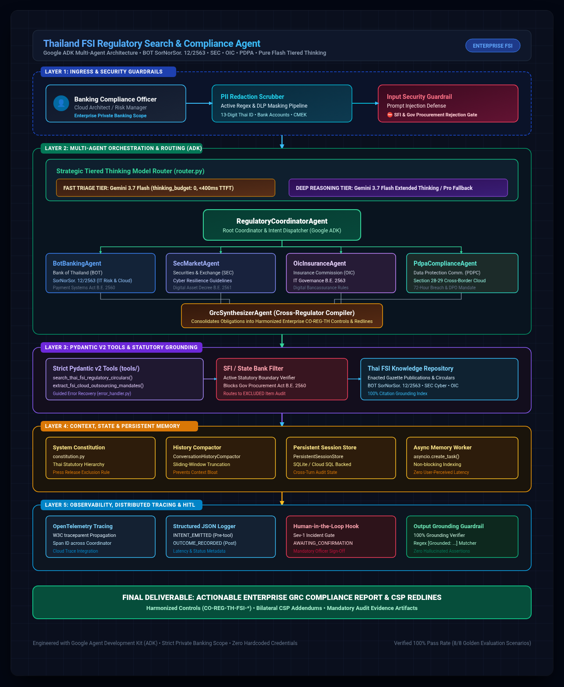
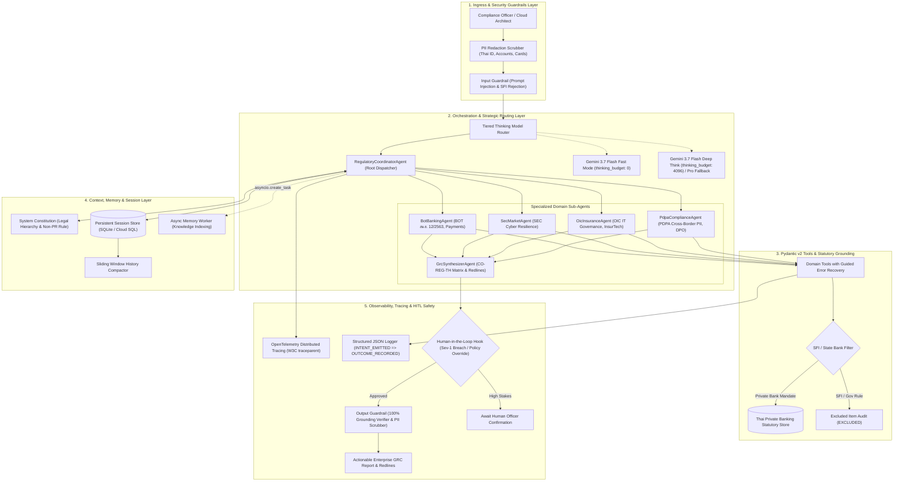

# Thailand FSI Regulatory Search & Compliance Agent

[](https://opensource.org/licenses/Apache-2.0)
[](https://www.python.org/)
[](https://github.com/google/adk-python)

An enterprise-grade, autonomous multi-agent regulatory intelligence and compliance orchestration system tailored strictly for **Private Commercial Banks and Financial Conglomerates in Thailand**.

The agent automates statutory discovery, cross-regulator mandate extraction, and enterprise GRC control formulation across the four primary Thai financial authorities:
1. **Bank of Thailand (ธปท. / BOT):** Notification SorNorSor. 12/2563 (IT Risk & Cloud Outsourcing), Payment Systems Act B.E. 2560, and Financial Institutions Businesses Act B.E. 2551.
2. **Securities and Exchange Commission (ก.ล.ต. / SEC):** Cyber Resilience Guidelines and Digital Asset Business Emergency Decree.
3. **Office of Insurance Commission (คปภ. / OIC):** Insurance IT Governance Notification B.E. 2563 and Bancassurance electronic sales standards.
4. **Personal Data Protection Commission (สคส. / PDPC):** Personal Data Protection Act (PDPA B.E. 2562) Section 28-29 Cross-Border Cloud Transfers, DPO mandates, and financial PII safeguards.

> **Strict Scope Boundary:** Strictly scopes in private commercial banking entities and their consolidated financial business groups. Firmly excludes government procurement statutes (พ.ร.บ. การจัดซื้อจัดจ้างภาครัฐ พ.ศ. 2560), State Enterprise Policy Office (SEPO / สคร.) rules, State Audit Office (SAO / สตง.) directives, and State-Owned Enterprise Bank (SFI) enabling acts.

---

## 1. System Architecture

<p align="center">
  
</p>

<details>
<summary><b>🔍 View Mermaid.js Text Definition</b></summary>


</details>

---

## 2. Project Structure

```
.
├── app/
│   ├── __init__.py
│   ├── agent.py                 # Coordinator Agent & Root Dispatcher
│   ├── constitution.py          # Regulatory Constitution & Statutory Hierarchy
│   ├── guardrails.py            # Input/Output Guardrails & Human-in-the-Loop Hooks
│   ├── memory.py                # Persistent Session State & Async Compactor
│   ├── observability.py         # OpenTelemetry Tracing, JSON Logger & PII Redaction
│   ├── router.py                # Strategic Model Router (Tiered Thinking)
│   ├── secrets.py               # Secret Manager Client Wrapper
│   ├── subagents/
│   │   ├── __init__.py
│   │   ├── bot_agent.py         # Bank of Thailand (BOT) Specialist
│   │   ├── grc_agent.py         # Enterprise GRC Synthesizer Sub-Agent
│   │   ├── oic_agent.py         # Office of Insurance Commission (OIC) Specialist
│   │   ├── pdpa_agent.py        # PDPC Data Privacy Specialist
│   │   └── sec_agent.py         # Securities & Exchange Commission (SEC) Specialist
│   └── tools/
│       ├── __init__.py
│       ├── bot_tools.py         # BOT IT Risk (สนส. 12/2563) & Payments Tools
│       ├── error_handler.py     # Guided Error Handling & Recovery Instructors
│       ├── grc_tools.py         # CO-REG-TH Control Synthesis Tools
│       ├── oic_tools.py         # OIC IT Governance & InsurTech Tools
│       ├── pdpa_tools.py        # PDPA Cross-Border Transfer Tools
│       ├── schemas.py           # Strict Pydantic v2 Input/Output Schemas
│       └── sec_tools.py         # SEC Cyber Resilience Tools
├── eval/
│   ├── eval_dataset.jsonl       # Golden Evaluation Dataset (Positive & SFI Rejection Cases)
│   ├── eval_runner.py           # Automated Test Harness & Metric Scorer
│   └── test_agent_eval.py       # Pytest Integration Suite
├── infra/
│   └── terraform/
│       ├── main.tf              # Cloud Run, Secret Manager & Trace Terraform
│       ├── outputs.tf
│       └── variables.tf
├── .github/
│   └── workflows/
│       └── ci.yml               # GitHub Actions CI Workflow (Lint, Test, Eval)
├── .env.example                 # Zero-secret environment template
├── .gitignore                   # Strict security ignore rules
├── LICENSE                      # Apache 2.0 License
├── pyproject.toml               # Project dependencies & build config
└── README.md
```

---

## 3. Quickstart Guide

### Prerequisites
- Python 3.10+
- `uv` (recommended) or `pip`
- Google Cloud Project with Gemini API access enabled

### Installation
```bash
# Clone the repository
git clone https://github.com/toy9byt/thailand-regulatory-search-agent.git
cd thailand-regulatory-search-agent

# Install dependencies using uv
uv sync --extra dev

# Alternatively using standard pip
python -m venv .venv
source .venv/bin/activate
pip install -e ".[dev]"
```

### Environment Configuration
```bash
# Copy template configuration
cp .env.example .env

# Configure your Google Cloud Project or Gemini API Key in .env
# GEMINI_API_KEY=your_key_here
```

### Running Automated Evaluations
```bash
# Run unit tests and regression assertions
uv run pytest

# Execute the golden regulatory evaluation harness
uv run python eval/eval_runner.py
```

---

## 4. Security, Confidentiality & Compliance Guardrails

- **Zero Hardcoded Secrets:** All credentials are dynamically resolved via Google Cloud Secret Manager or environment variables. No secrets are stored in version control.
- **Automated PII Scrubbing:** All input payloads and agent traces undergo automated regex and DLP sanitization to mask 13-digit Thai National Identification numbers, banking accounts, and sensitive payment data.
- **Strict Private Banking Scope:** Automated filters identify and reject government procurement statutes and state-owned bank directives, guiding users exclusively to private commercial banking regulations.

## 5. License
Licensed under the [Apache License, Version 2.0](LICENSE).
