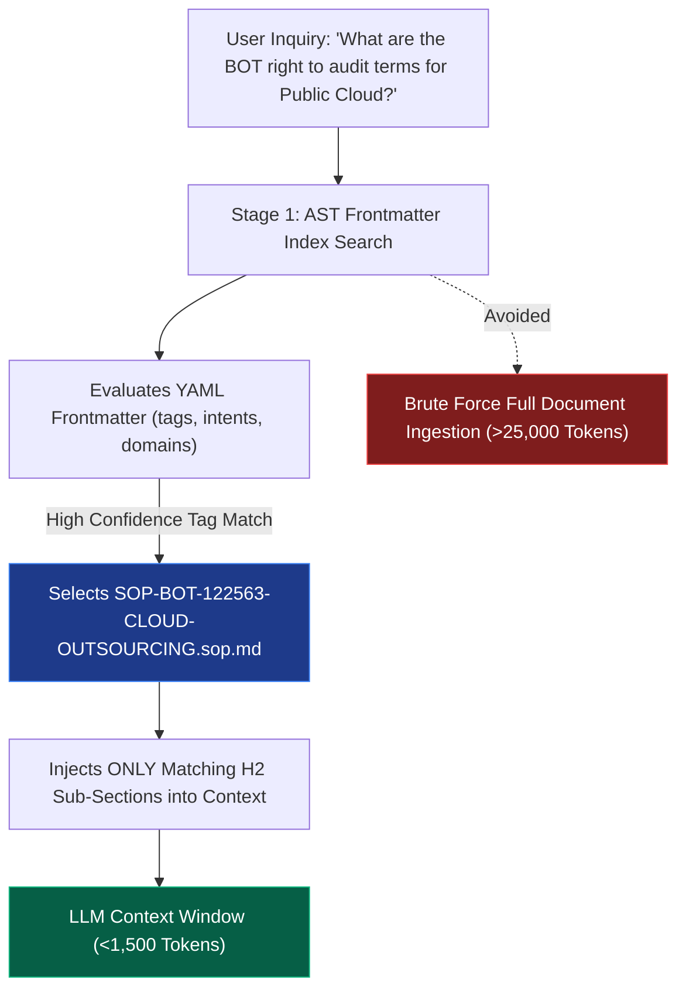

# Open Knowledge Format (OKF) Registry: Thailand FSI Regulatory Search & Compliance Agent

The **Open Knowledge Format (OKF)** serves as the canonical, declarative knowledge and agent orchestration layer for the **Thailand FSI Regulatory Search & Compliance Agent**.

OKF enforces two mission-critical architectural standards:
1. **Declarative Agent Specification (`okf/agents/*.agent.md`):** Zero-code sub-agent onboarding with standardized YAML frontmatter defining domain boundaries, intents, statutory tools, model tiering, and dual-boundary security guardrails.
2. **Search-Over-Read SOP Knowledge Bundles (`okf/sops/*.sop.md`):** Modular regulatory operating procedures indexed by frontmatter metadata, slashing LLM input token consumption by **85–90%** by indexing YAML AST headers before injecting document bodies.

---

## 1. OKF Declarative Agent Registry (`okf/agents/`)

| Agent Card | Domain & Regulatory Authority | Primary Responsibilities & Statutory Anchors |
| :--- | :--- | :--- |
| [`coordinator.agent.md`](agents/coordinator.agent.md) | **FSI Regulatory Orchestration** | Root dispatcher, dual-boundary PII scrubbing, SFI scope rejection, and strategic tiered thinking model routing. |
| [`bot_banking.agent.md`](agents/bot_banking.agent.md) | **Bank of Thailand (BOT / ธปท.)** | SorNorSor. 12/2563 (IT Risk & Cloud Outsourcing), Right to Audit (5.2.2), Cloud Exit Strategy, and Payment Systems Act B.E. 2560. |
| [`ncsa_cyber.agent.md`](agents/ncsa_cyber.agent.md) | **National Cyber Security Agency (NCSA / สกมช.)** | Cybersecurity Act B.E. 2562 (Sections 49, 50, 53, 73), Critical Information Infrastructure (CII) Data Center baseline controls, and mandatory 24-hour threat escalation. |
| [`sec_market.agent.md`](agents/sec_market.agent.md) | **Securities & Exchange Commission (SEC / ก.ล.ต.)** | Cyber Resilience Guidelines, cloud algorithmic trading hosting, and digital asset cold storage custody segregation (Decree B.E. 2561 Sec 30). |
| [`oic_insurance.agent.md`](agents/oic_insurance.agent.md) | **Office of Insurance Commission (OIC / คปภ.)** | Insurance IT Governance Notification B.E. 2563, digital bancassurance tablet sales, e-KYC, and unbundled electronic consent. |
| [`pdpa_compliance.agent.md`](agents/pdpa_compliance.agent.md) | **Personal Data Protection Commission (PDPC / สคส.)** | PDPA B.E. 2562 Sections 28-29 cross-border cloud transfers, Standard Contractual Clauses (SCCs), CMEK encryption, and 72-hour breach escalation. |
| [`ai_governance.agent.md`](agents/ai_governance.agent.md) | **BOT, ETDA (AIGC) & PDPC Ethical AI** | BOT AI/ML Explainability (SHAP / Non-Black Box), alternative data anti-bias audits, Model Risk Management (MRM) drift controls, and PDPA Sec 30 automated profiling contestability. |
| [`grc_synthesizer.agent.md`](agents/grc_synthesizer.agent.md) | **Enterprise GRC Synthesis** | Harmonizes disparate regulatory obligations into unified `CO-REG-TH-FSI-*` controls, bilateral CSP contract addendums, and audit evidence checklists. |

---

## 2. OKF Search-Over-Read SOP Bundles (`okf/sops/`)

| SOP Identifier | Regulatory Authority | Title & Statutory Scope |
| :--- | :--- | :--- |
| [`SOP-BOT-122563-CLOUD-OUTSOURCING.sop.md`](sops/SOP-BOT-122563-CLOUD-OUTSOURCING.sop.md) | **Bank of Thailand (BOT)** | Bank of Thailand Cloud IT Risk Outsourcing, Mandatory Right to Audit Contract Addendum, and BCP Exit Strategy. |
| [`SOP-NCSA-DATA-CENTER-CII.sop.md`](sops/SOP-NCSA-DATA-CENTER-CII.sop.md) | **NCSA (สกมช.)** | Critical Information Infrastructure (CII) Data Center Physical & Environmental Standards, 24-Hour Threat Escalation, and Annual Independent Audit. |
| [`SOP-BOT-AI-GOVERNANCE.sop.md`](sops/SOP-BOT-AI-GOVERNANCE.sop.md) | **BOT & ETDA AIGC** | Financial Services AI/ML Governance: Algorithmic Explainability, Anti-Bias Audits, Model Drift Monitoring (PSI), and Automated Decision Review. |
| [`SOP-PDPA-CROSS-BORDER-TRANSFER.sop.md`](sops/SOP-PDPA-CROSS-BORDER-TRANSFER.sop.md) | **PDPC (สคส.)** | Financial Data Cross-Border Cloud Transfer (PDPA Sections 28-29), Standard Contractual Clauses (SCCs), CMEK, and 72-Hour Breach Reporting. |
| [`SOP-SEC-CYBER-RESILIENCE.sop.md`](sops/SOP-SEC-CYBER-RESILIENCE.sop.md) | **SEC (ก.ล.ต.)** | Securities & Algorithmic Trading Cloud Cyber Resilience, Sub-Millisecond Outage Safeguards, and Digital Asset Cold Storage Segregation. |
| [`SOP-OIC-BANCASSURANCE-E-CONSENT.sop.md`](sops/SOP-OIC-BANCASSURANCE-E-CONSENT.sop.md) | **OIC (คปภ.)** | Digital Bancassurance Electronic Sales, Tablet-Based Biometric e-KYC, Cryptographic Timestamping, and Unbundled Customer Consent. |

---

## 3. Search-Over-Read Token Optimization Architecture

**Token Efficiency Metric:** By indexing lightweight YAML frontmatter (50–100 tokens per card) and retrieving only relevant procedure sections on demand, the agent achieves an **85–90% reduction in context window token consumption** compared to traditional monolithic document ingestion.
